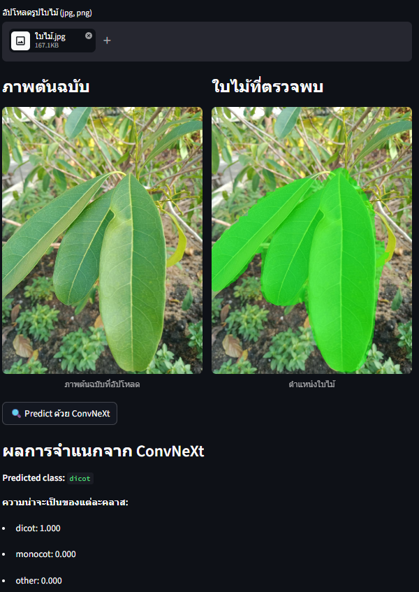
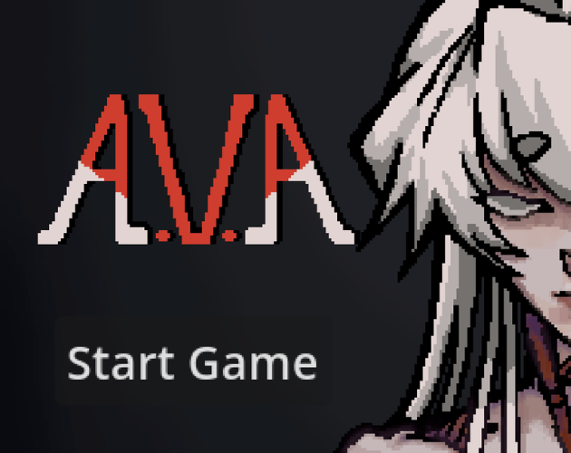
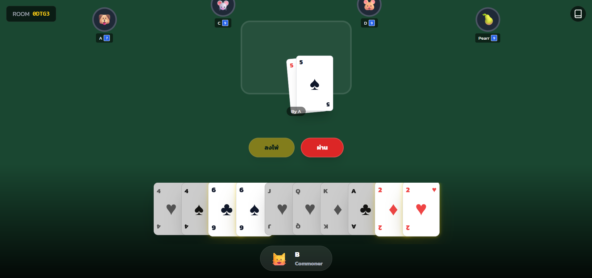

# Anucha Saelee Portfolio

Jekyll portfolio using the GitHub Pages Minimal theme.

## Main files

- `_config.yml` - Jekyll and Minimal theme settings
- `index.html` - portfolio content
- `assets/anucha-saelee-resume.pdf` - resume download
- `assets/img/leaf-classification-web-service.png` - Leaf Classification Web Service screenshot
- `assets/img/mu-course-review.png` - MU Course Review screenshot
- `assets/img/ava-game.png` - A.V.A game screenshot
- `assets/img/slave-online-card-game.png` - Slave Online Card Game screenshot

The profile image uses the public GitHub avatar URL in `_config.yml`, so changes
to the GitHub profile photo should appear on the portfolio after GitHub/CDN cache
refreshes.

## Project screenshots

### Leaf Classification Web Service



### MU Course Review Web Service


### A.V.A - Thailand Summer Jam 2026



### Slave Online Card Game



## Publish with GitHub Pages

1. Create a repository named `shiniji123.github.io`.
2. Upload these files to the repository root.
3. Open `Settings > Pages`.
4. Choose `Deploy from a branch`.
5. Select `main` and `/root`, then save.

The portfolio will publish at:

```text
https://shiniji123.github.io/
```

## Local preview

Opening `index.html` directly will not show the theme, because Jekyll needs to
process the front matter first.

On this Windows machine, you can run:

```powershell
.\serve.bat
```

Then open:

```text
http://127.0.0.1:4000
```

If Ruby and Bundler are installed:

```powershell
bundle install
bundle exec jekyll serve
```

Then open:

```text
http://localhost:4000
```
